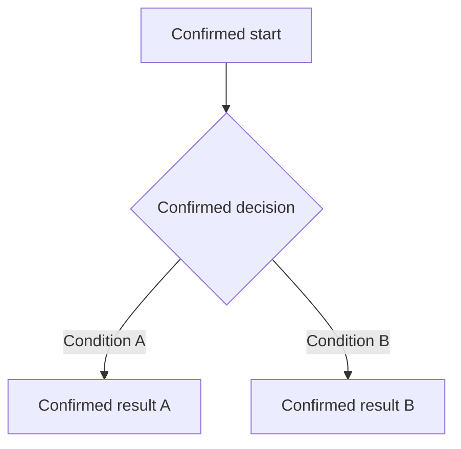

# Portable Markdown Template

## Document Order

1. title and metadata
2. background, goal, users, scope, non-goals, success
3. source and page map
4. information architecture, flows, and states
5. page requirements
6. rules, data, dependencies, and recovery as applicable
7. measurement as applicable
8. acceptance summary
9. confirmed decision record
10. future optimization when explicitly retained

Omit inapplicable sections instead of filling them with invented content.

## Page Layout

Use a compact visual summary followed by editable detail:

```markdown
## 页面需求

### P01 Page Name

> Type: Page | Source: `assets/P01.png`

| Prototype | Requirement summary |
|---|---|
|  | **Purpose**<br>Confirmed purpose.<br><br>**Key elements**<br>1. Element A<br>2. Element B<br><br>**Interactions**<br>1. Action and confirmed result |

#### Entry And Preconditions

- Confirmed entry behavior.

#### States And Recovery

| State | Trigger | Visible behavior | Exit or recovery |
|---|---|---|---|
| Default | Page entry | Confirmed display | Confirmed action |

#### Acceptance Criteria

- Given ..., when ..., then ...
```

Keep the right table cell concise. Place long rules below the table so future edits remain comfortable.

## Flow Layout

Use Mermaid for meaningful multi-step or branching flows and follow it with concise text:



Do not invent a branch solely to make a diagram look complete.

## Portability

- use relative image paths
- use standard headings, lists, blockquotes, tables, images, and fenced Mermaid
- avoid external CSS, scripts, editor directives, or style-dependent meaning
- avoid nested tables and long prose inside table cells
- use `<br>` only inside the compact summary table
- include text steps when Mermaid support is uncertain

## Final Sections

Use `已确认决策记录`, never `待确认问题`. Use `后续优化` only for explicitly accepted non-blocking ideas and label them outside current acceptance.
